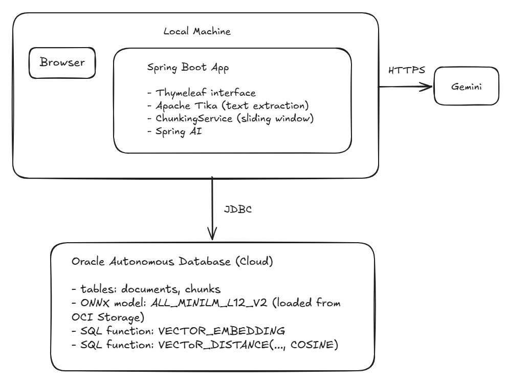
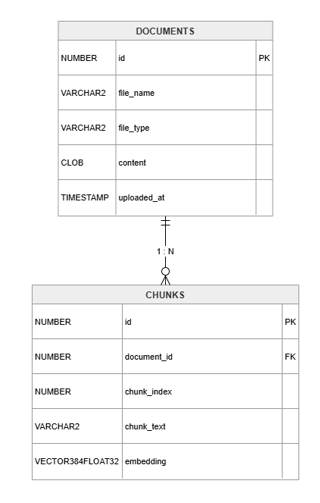
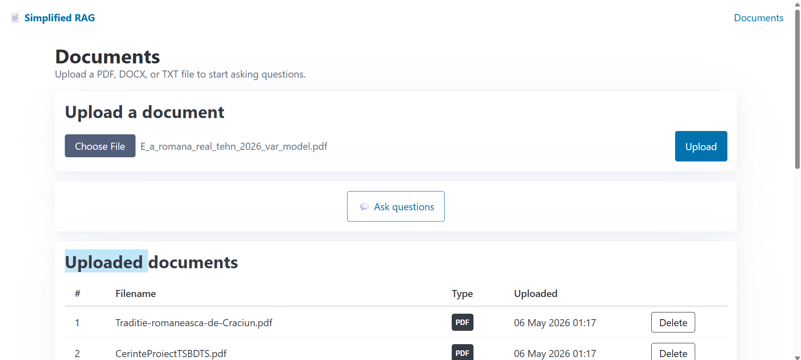
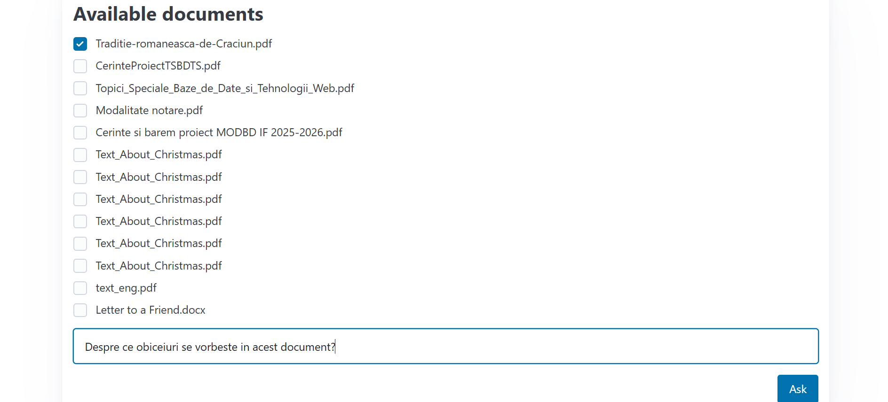
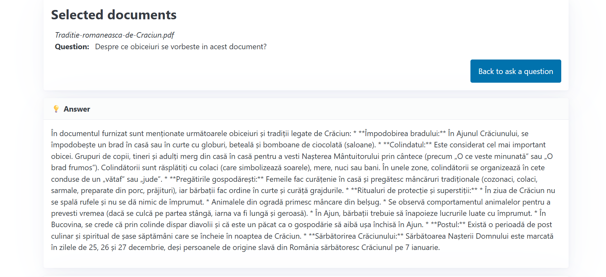
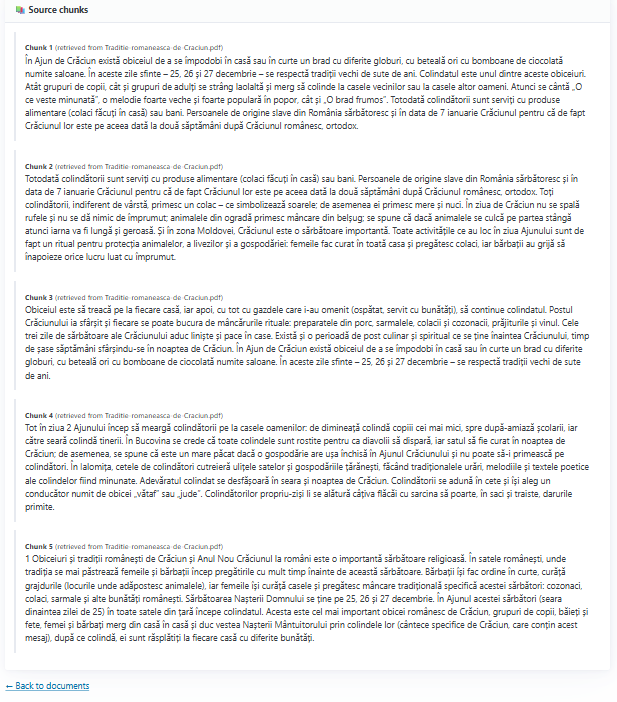

# Simplified RAG — Oracle AI Vector Search

This project was implemented for the Special Topics in Databases and Software Technologies course. It consists in a simplified RAG(Retrieval Augmented Generation)
application that allows users to upload documents and ask questions answered exclusively from the selected corpus of documents. Text embeddings
are generated natively inside Oracle Database 23ai using an ONNX model. Answer generation uses Gemini on the "main" branch, but there also is a Groq 
version on the "groq" branch. The application runs locally, the database is hosted on Oracle Cloud (Autonomous Database), the communication with Gemini is done 
through Spring AI, while the communication with groq consists in API calls.

---

## Table of Contents

1. [Architecture](#architecture)
2. [Data Model](#data-model)
3. [Configuration](#configuration)
4. [Key Code Fragments](#key-code-fragments)
5. [Running the Application](#running-the-application)
6. [Screenshots](#screenshots)
7. [References](#references)

---

## Architecture




### Upload flow

1. User uploads a PDF, DOCX, or TXT file. These are the only allowed types.
2. **Apache Tika** identifies the type of the file and extracts plain text.
3. **ChunkingService** splits the text into overlapping chunks (128 words, 32-word overlap, it also minds where a sentence ends and a new one begins).
4. Each chunk is saved to the `chunks` table.
5. Oracle's `VECTOR_EMBEDDING(ALL_MINILM_L12_V2 USING ? AS data)` SQL function generates an embedding vector for each chunk in-database.

### Query flow

1. User selects one or more documents and submits a question.
2. The question is embedded in Oracle using the same ONNX model.
3. A `VECTOR_DISTANCE(..., COSINE)` query retrieves the 5 most semantically similar chunks from the selected documents.
4. The chunks are assembled into a context string and sent to Gemini/groq with a strict "answer only from context" system prompt, in order to phrase the answer in an intelligible manner.
5. The answer and the source chunks are displayed to the user.

---

## Data Model



CONTENT stores the full extracted text of each document, so that it can be used for re-processing if needed. EMBEDDING is an Oracle 23ai VECTOR type and is populated after insert using a raw JDBC UPDATE that calls VECTOR_EMBEDDING.

---

## Configuration

### Oracle Cloud setup

The database is an Oracle Autonomous Database (Serverless) instance on OCI. Connection credentials (DATASOURCE_URL, DATASOURCE_USERNAME, DATASOURCE_PASSWORD) are stored in application-secrets.yml (has to be added after cloning repository, not committed).

On first startup, the schema.sql script is executed, which is creating the necessary tables in the database. Also,
OnnxLoader checks whether the ALL_MINILM_L12_V2 model is already registered in user_mining_models. 
If not, it downloads the .onnx file from a public OCI Object Storage bucket and loads it into the database using
DBMS_VECTOR.LOAD_ONNX_MODEL.
---

## Key Code Fragments

### 1. ONNX model loading into Oracle

On first startup, the application loads the embedding model directly into the Oracle database:

```java
jdbc.execute("""
    DECLARE
        ONNX_MOD_FILE VARCHAR2(100) := 'all_MiniLM_L12_v2.onnx';
        LOCATION_URI  VARCHAR2(200) := 'https://adwc4pm.objectstorage...';
    BEGIN
        DBMS_CLOUD.GET_OBJECT(
            credential_name => NULL,
            directory_name  => 'DATA_PUMP_DIR',
            object_uri      => LOCATION_URI || ONNX_MOD_FILE
        );
        DBMS_VECTOR.LOAD_ONNX_MODEL(
            directory  => 'DATA_PUMP_DIR',
            file_name  => ONNX_MOD_FILE,
            model_name => 'ALL_MINILM_L12_V2'
        );
    END;
""");
```

### 2. Embedding generation (in-database)

After saving each chunk, a raw JDBC update calls Oracle's built-in SQL function to compute and store the vector:

```java
jdbc.update("""
    UPDATE chunks
    SET embedding = VECTOR_EMBEDDING(ALL_MINILM_L12_V2 USING ? AS data)
    WHERE id = ?
""", chunkText, chunkId);
```

### 3. Semantic vector search

Retrieval ranks chunks by cosine similarity between the question embedding and stored chunk embeddings:

```sql
SELECT *
FROM chunks
WHERE document_id IN (:ids)
ORDER BY VECTOR_DISTANCE(
    embedding,
    VECTOR_EMBEDDING(ALL_MINILM_L12_V2 USING :question AS data),
    COSINE
)
FETCH FIRST 5 ROWS ONLY
```

### 4. Text chunking strategy

Documents are split into 128-word chunks with a 32-word overlap, breaking at sentence full stops where possible:

```java
// ChunkingService.java — sliding window with sentence-boundary awareness
// chunk size: 128 words | overlap: 32 words
// break characters: . ! ? ;
```

---

## Running the Application

### Prerequisites

- Java 21+
- Maven 3.9+
- An Oracle Autonomous Database 23ai instance (OCI)
- A Gemini/Groq API key

### Configuration

Create src/main/resources/application-secrets.yml (not committed to the repository):

```yaml
DATASOURCE_URL: jdbc:oracle:thin:@<your-adb-connection-string>
DATASOURCE_USERNAME: your_db_user
DATASOURCE_PASSWORD: your_db_password
GEMINI_KEY: your_key_here
```

### Build and run

```bash
mvn spring-boot:run
```

The application will start on `http://localhost:8080`.

### Database schema

The tables don't have to exist before running, the schema.sql file is being run at each start of the application.

---

## Screenshots









---

## References

https://docs.oracle.com/en/database/oracle/oracle-database/23/vecse/sql-quick-start-using-vector-embedding-model-uploaded-database.html
https://docs.oracle.com/en/database/oracle/oracle-database/23/vecse/import-onnx-models-oracle-ai-database-end-end-example.html
https://blogs.oracle.com/machinelearning/use-our-prebuilt-onnx-model-now-available-for-embedding-generation-in-oracle-database-23ai
https://docs.spring.io/spring-boot/docs/4.0.x/reference/html/
https://console.groq.com/docs/openai
https://medium.com/@ashokreddy20020427/integrating-google-gemini-with-spring-boot-using-spring-ai-chatclient-a25ec80189de
